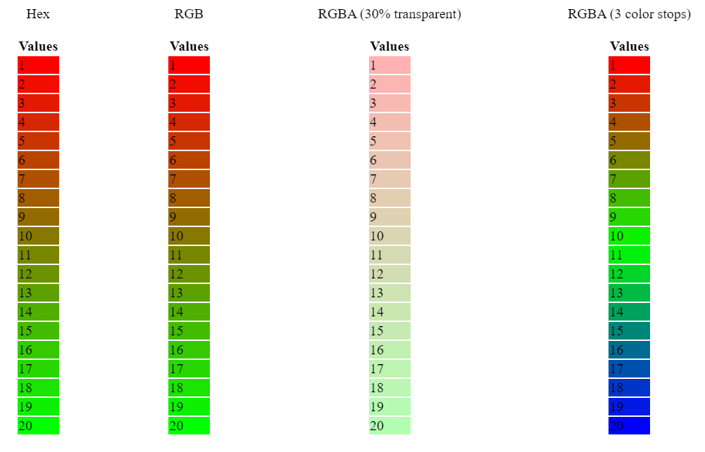

# color-scales
A utility mimicking Microsoft Excel's Color Scales conditional formatting, which returns the color of a value in a linear gradient between two color endpoints with defined min and max values.

### [Basic CodePen Demo](https://codepen.io/dalisc/pen/yLVXoeR)



## Usage

### Install from NPM

```
npm i color-scales
```
Import it in your project:
```ts
const ColorScale = require("color-scales")
```

Alternatively, import directly from Skypack, a free CDN for Javascript/TypeScript packages:

```ts
import ColorScale from "https://cdn.skypack.dev/color-scales";
```

### Important Classes

#### ColorScale Class

The `ColorScale` has the following properties:

- `min` (number): The minimum value of the range.
- `max` (number): The maximum value of the range.
- `colorStops` (string[]): An array of colors that act as color stops for the gradient. The colors are spaced out evenly. At least two colors must be passed in. Example: ['#ff0000', '#00ff00', '#0000ff']
- `alpha` (number): The alpha value that indicates the level of transparency/opagueness. E.g. Alpha of 0.8 means 20% transparent. Optional, defaults to 1.

Its constructor is `ColorScale(min, max, colorStops, alpha)`;

The `ColorScale` class has the following functions:

- `getColor`: Param: number. Returns an instance `Color` corresponding to the numerical value supplied, calculated based on the class properties above.

#### Color Class

The `Color` class is an unexported class. It has the following properties:

- `r`: An integer representing the intensity of the red hue. Ranges from 0 to 255.
- `g`: An integer representing the intensity of the green hue. Ranges from 0 to 255.
- `b`: An integer representing the intensity of the blue hue. Ranges from 0 to 255.
- `a`: The alpha value that indicates the level of transparency/opagueness. E.g. Alpha of 0.8 means 20% transparent. Defaults to 1.

The `Color` class has the following functions:

- `toHexString`: Returns the equivalent hex string representation. The string will be in lower case. Does not support transparency. Example: "#7f7f7f"
- `toRGBString`: Returns the equivalent RGB string representation. The string will be in lower case. Does not support transparency. Example: "rgb(127,127,127)"
- `toRGBAString`: Returns the equivalent RGBA string representation. The string will be in lower case. Example: "rgba(127,127,127, 0.8)"

## Example Usage

#### Constructor

The following import and constructor creates a `ColorScale` object.

``` ts
const ColorScale = require("color-scales");
// Alternatively, import from Skypack, a free CDN for Javascript/TypeScript packages:
// import ColorScale from "https://cdn.skypack.dev/color-scales";

let colorScale = new ColorScale(min, max, colorStops, alpha); // alpha is optional. defaults to 1
 ```

where `min`, `max`, `colorStops`, and `alpha` are replaced by their intended value;

Example:

```ts
const ColorScale = require("color-scales");

let colorScale = new ColorScale(0, 100, ["#ffffff", "#000000"], 0.5); // white to black from 0 to 100 with 50% transparency
```

#### Get Color Object

Example:

```ts
const ColorScale = require("color-scales");

let colorScale = new ColorScale(0, 100, ["#ffffff", "#000000"], 0.5); // red to green from 0 to 100
let colorObj = colorScale.getColor(50); // returns new Color(127, 127, 127, 0.5)
```

#### Get Hex String

Example 1 (full opacity):
```ts
let colorScale = new ColorScale(0, 100, ["#ffffff", "#000000"]); // passing in no alpha value defaults it to 1
let hexStr = colorScale.getColor(50).toHexString(); // returns "#7f7f7f"
```


Example 2 (0.5 alpha):
```ts
let colorScale = new ColorScale(0, 100,[ "#ffffff", "#000000"], 0.5);
let hexStr = colorScale.getColor(50).toHexString(); // returns "#3f3f3f"
```


As this will give acolor  equivalent to if the transparent color was overlaid on a white background. This package version does not support 8-digit hex values. Thus, if users want to implement true transparency, it is recommended that they use the RGBA string option documented in the next section.


#### Get RGB String

Example 1 (full opacity):
```ts
let colorScale = new ColorScale(0, 100, ["#ffffff", "#000000"]); // passing in no alpha value defaults it to 1
let rgbStr = colorScale.getColor(50).toRGBString(); returns "rgba(127,127,127)"
```


Example 2 (0.5 alpha):
```ts
let colorScale = new ColorScale(0, 100, ["#ffffff", "#000000"], 0.5);
let rgbStr = colorScale.getColor(50).toRGBString(); // returns "rgba(63,63,63)"
```

As this will give color equivalent to if the transparent color was overlaid on a white background. Thus, if users want to implement true transparency, it is recommended that they use the RGBA string option documented in the next section.


#### Get RGBA String

Example 1 (full opacity):
```ts
let colorScale = new ColorScale(0, 100, ["#ffffff", "#000000"]);
let rgbaStr = colorScale.getColor(50).toRGBAString(); // returns "rgba(127,127,127)"
```

Example 2 (50% transparent):

```ts
let colorScale = new ColorScale(0, 100, ["#ffffff", "#000000"], 0.5);
let rgbaStr = colorScale.getColor(50).toRGBAString(); // returns "rgba(127,127,127, 0.5)"
```
